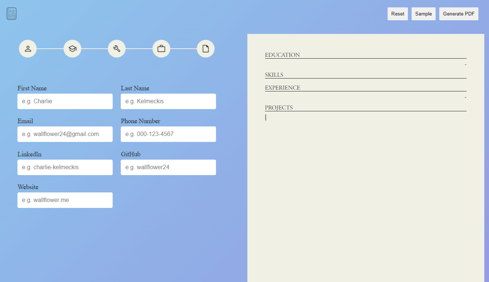
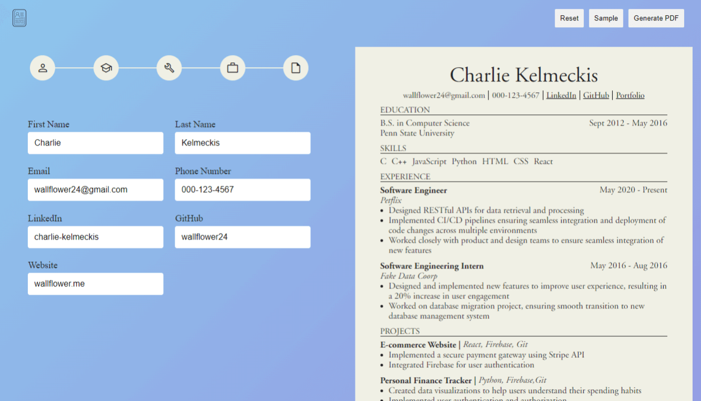

# Resume Generator

A Resume Generator application built with React for TheOdinProject. The app allows users to enter their personal details, education, skills, experience, and projects and then generates a PDF document that is automatically downloaded and can be printed.

## Features

- **Live Preview** 
  See a live preview of the resume as it gets created 

- **PDF Generation** 
  Automatic PDF generation and download 

- **Sample Data** 
  Load sample data to see how the resume will look like with pre-populated information 

- **Reset** 
  Easily clear all the fields in one go 

- **Social Links** 
  Add social links to the resume 

## Roadmap

- [ ] Add functionality for changing the color of the title or name
- [ ] Add functionality for reordering the sections
- [ ] Add templates
- [ ] Add input field for project links

## Learnings

- React fundamentals: State, Props, Forms, and Rendering lists
- CSS Modules for styling
- Creation of PDF documents using @react-pdf/renderer, including adding styles and fonts
- Basic usage of Vite
- Saving files using file-saver

## Preview

### When loaded with sample data

## Demo

👉 [Live Demo](https://ruchita1010.github.io/resume-generator)
